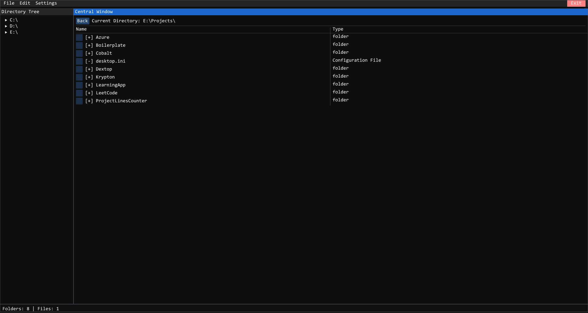
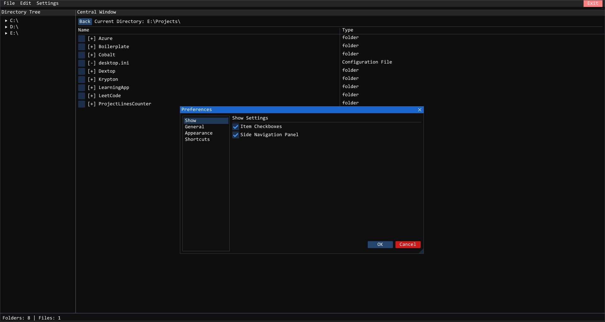
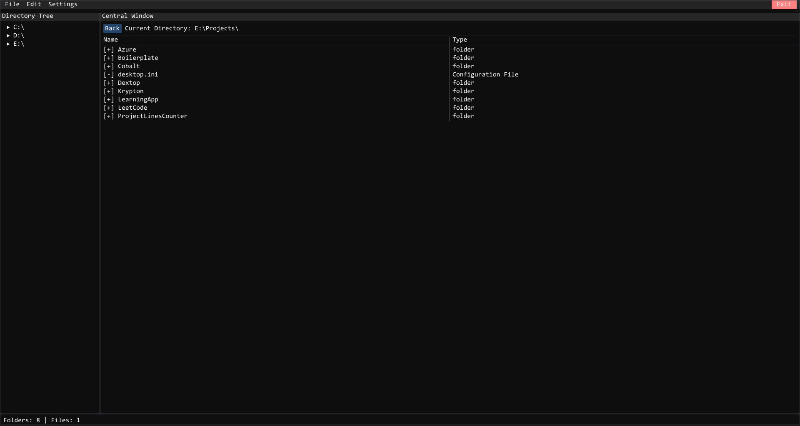
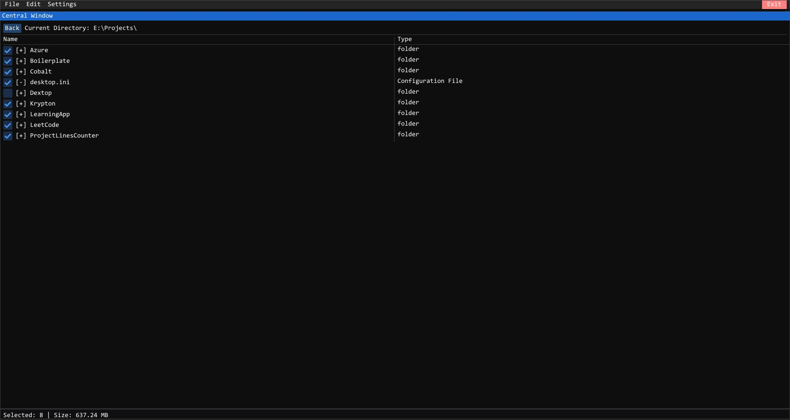

# Dextop

A modern, ImGui-powered file manager for Windows, built with C++20 and OpenGL. Dextop provides a fast, minimal, and customizable desktop file explorer experience.

---

## Features

- **Side Navigation Panel**: Quickly browse drives and folders with a collapsible tree view.
- **Central File/Folder Listing**: View, select, and manage files and folders with type detection and icons.
- **Edit Menu**: Cut, Copy, Delete, Rename, Share, and create new Files, Folders, or Shortcuts.
- **Custom File/Folder Picker**: ImGui-based dialogs for selecting files and folders (no native Windows popups).
- **Preferences**: Toggle UI features like item checkboxes and side navigation panel.
- **Async Folder Stats**: Recursively calculate folder size and file count in the background.
- **Status Bar**: Shows details for selected items and checked items (with size summary).
- **Dark Theme**: Clean, modern look with customizable appearance.

---

## Screenshots

<p align="center">
  
  
  
  
</p>


---

## Build Instructions

1. **Requirements:**
   - Windows 10/11
   - Visual Studio 2019 or later (with C++20 support)
   - [GLFW](https://www.glfw.org/) and [ImGui](https://github.com/ocornut/imgui) (included or add as submodules)
   - [nlohmann/json](https://github.com/nlohmann/json) (header-only)

2. **Clone the repository:**
   ```sh
   git clone https://github.com/CYB3RPHO3NIX/Dextop.git
   cd Dextop
   ```

3. **Open the solution in Visual Studio** and build the `Dextop` project.

4. **Run the application**. The main window will appear maximized with the custom file manager UI.

---

## Usage

- Use the **Edit > New** menu to create files, folders, or shortcuts.
- Use the **side navigation** to browse drives and folders.
- Select files/folders to see details in the status bar.
- Use the **Preferences** window to customize the UI.

---

## License

[MIT License](LICENSE)

---

## Credits

- [ImGui](https://github.com/ocornut/imgui)
- [GLFW](https://www.glfw.org/)
- [nlohmann/json](https://github.com/nlohmann/json)

---

## Contributing

This project is **heavily under development**. Contributions, bug reports, and feature requests are very welcome! Please open an issue to discuss your ideas or report bugs. Pull requests are encouraged, but expect rapid changes and possible refactors as the project evolves.

---

## Contact

- GitHub: [CYB3RPHO3NIX](https://github.com/CYB3RPHO3NIX)
- Twitter: [@cyb3rpho3nix](https://twitter.com/cyb3rpho3nix)
